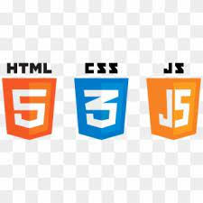

# COVIRESIST

As the name suggests coviresisit which means resisting the coronavirus. This project is based on the COVID-19 pandemic. It shows the world's covid-19 dashboard which updates on daily basis. Likewise, it displays India's states and districts' covid-19 dashboard. It also contains a vaccine slot finder application which allows the user to check the availability of vaccines in his/her locality. It keeps users updated with daily covid-19 pandemic news. One can also search and donate for the covid-19 related resources through this webpage.

# TECH STACK

# Screenshots
## Desktop Views
<pre>
   

   
</pre>

## Responsive Designs

<pre>
   
</pre>

## Key Features
1. World and India COVID-19 Dashboard.
2. Vaccine slot finder (Search by PIN).
3. Latest Covid-19 info and news.
4. REAL TIME APPLICATION (Cowin and news APIs).
5. Attractive user interface and clean UI.
6. Organised arrangement of data.

## References
1. [API SETU](https://apisetu.gov.in/public/marketplace/api/cowin) : COVID-19 Dashboard
2. [Cowin API](https://apisetu.gov.in/public/marketplace/api/cowin) : Vaccine slots
3. [G-News API](https://newsapi.org/s/google-news-in-api) : COVID-19 news
4. [Images](https://unsplash.com/) : Bg images

# Motivation for the project

Many people in the world are losing their life due to misinformation and lack of knowledge. I believe this website will guide people on how to deal with this pandemic and how to help others. They can easily get all the latest information regarding covid-19 from this website. It also helps them for booking their vaccination slot.

## How our 7 Days of Web Development helped you in making this project?

The 7 days of web development codeathon enhances my HTML, CSS, and JAVASCRIPT knowledge. It makes me more familiar with APIs and different CSS frameworks. It helps me in making my code both qualitative and less quantitative. 

### Name - Darshan AGRAWALLA
### Regd no. - 1941012792
